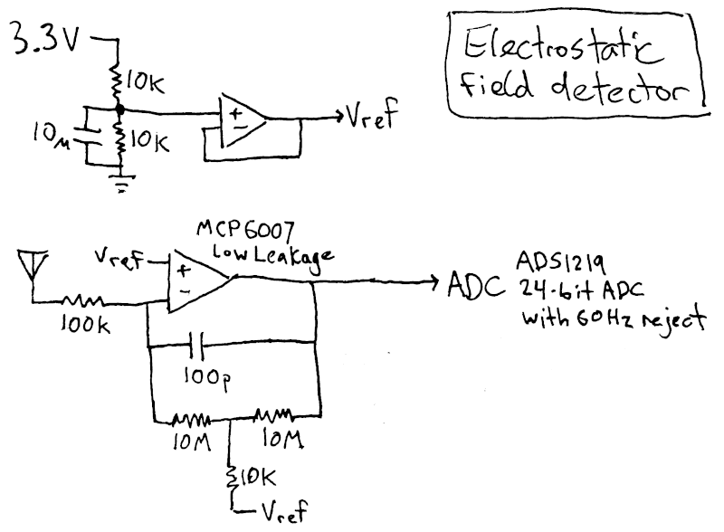
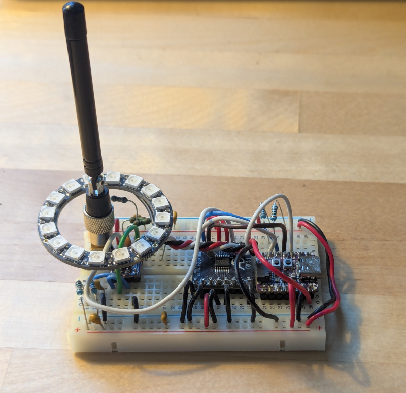

# ESP32 Arduino electrometer with NeoPixel and web plot

This is a simple circuit that detects changes in static electric field.  Readings are displayed on a NeoPixel ring and (optionally) on a web plot over wifi.  Move your hand near it and the pixel ring will spin.  If you're standing on carpet with shoes on, lifting your foot will make it go crazy.  It can detect lightning and cats.

## Theory of operation

We are holding the antenna at a constant voltage (Vref) and measuring how much current had to flow in or out of the antenna to keep it that way.  Ideally, a current integrator consists of an op-amp with nothing but a capacitor in the feedback loop.  Practically, this simple configuration has a problem: over time the output will drift and will eventually go beyond the limits of the power rails (0-3.3 volts).  A large value resistor in parallel with the capacitor will prevent this.

Now some numbers.  The smaller the feedback capacitor, the more sensitive it will be.  100pF is about perfect, making it sensitive enough to pick up anything above the noise floor.  For the feedback resistor, we need to decide how quickly we want the value to decay to zero.  A time constant of 1 second works well here.  Solving 100pF * R = 1 second gives us a value of 10 gigaohms.

You can buy a 10GΩ resistor, but it's $20, not always in stock, and it's not gonna be available in surface mount.  If you touch it with greasy fingers, it might not be 10GΩ anymore.  Luckily, we can simulate a 10GΩ resistor using a T-network.  It seems too good to be true, but the math checks out and it works in practice.

Some practicalities:

* With such a high value feedback resistor, we need an op-amp with low leakage current or we'll end up with an unacceptable offset in the output (possibly pushing it beyond the power rails).
* The 100k resistor on the antenna doesn't do anything.  It's there to protect the op-amp from ESD and whatnot.

## Parts list

* [QtPy ESP32-S2](https://www.adafruit.com/product/5325)
* [MCP6007 - low leakage op-amp](https://www.digikey.com/en/products/detail/microchip-technology/MCP6007-E-MS/12807177)
* [ADS1219 - 24-bit ADC with 50Hz/60Hz reject](https://www.digikey.com/en/products/detail/texas-instruments/ADS1219IPWR/9597825)
* [NeoPixel Ring, 16 pixels](https://www.adafruit.com/product/1463)
* Resistors: 3 * 10k, 100k, 2 * 10M, 1 * 1k
* Capacitors: 10uF, 100pF
* Antenna: details are not critical.  Just a piece of wire.

## Wiring

* ADC pins 1,2,4,5,7 to GND, pins 3,9,12,13 to 3.3 volts.
* ADC pin 11 to op-amp output.
* ADC pin 14 to QtPy pin A3.
* ADC pin 15 to QtPy pin SDA, with 1k pull-up to 3.3 volts.
* ADC pin 16 to QtPy pin SCL, with 1k pull-up to 3.3 volts.
* NeoPixel data wires to QtPy pin A2.  NeoPixel power 5 volts.

## Firmware building

I'm using the Arduino CLI.  If you are using the GUI, you're on your own here.  The build/upload command:

    arduino-cli --fqbn esp32:esp32:adafruit_qtpy_esp32s2 -p /dev/ttyACM0 compile -u --warnings all

You will also need to upload the assets for the web server:

    # https://stackoverflow.com/questions/71952177/firebeetle-esp32-and-mklittlefs-parameters
    cp ~/.arduino15/packages/esp32/hardware/esp32/2.0.11/tools/partitions/default.csv partitions.csv
    grep spiffs partitions.csv
        spiffs,   data, spiffs,  0x290000,0x160000,
    ~/.arduino15/packages/esp32/tools/mklittlefs/3.0.0-gnu12-dc7f933/mklittlefs -c ./data -p 256 -b 4096 -s $((0x160000)) spiffs.bin
    python3 ~/.arduino15/packages/esp32/tools/esptool_py/4.5.1/esptool.py --chip esp32s2 --port "/dev/ttyACM0" --baud 921600  --before default_reset --after hard_reset write_flash -z --flash_mode dio --flash_freq 80m --flash_size detect $((0x290000)) spiffs.bin

